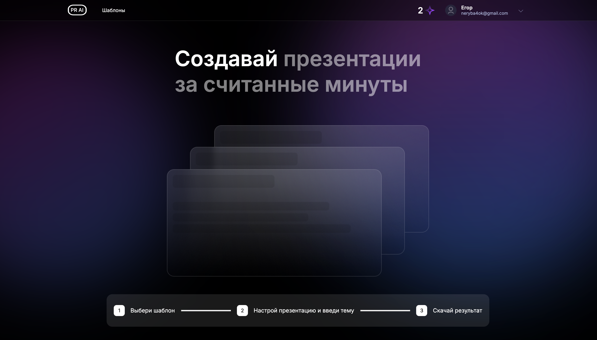
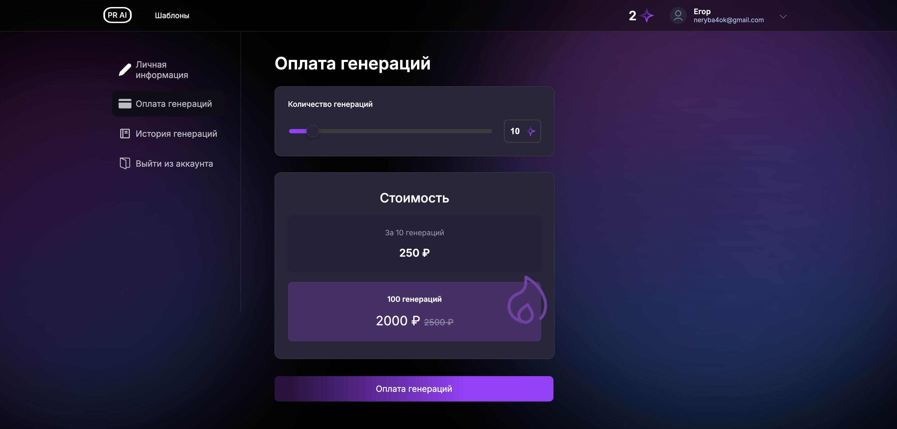
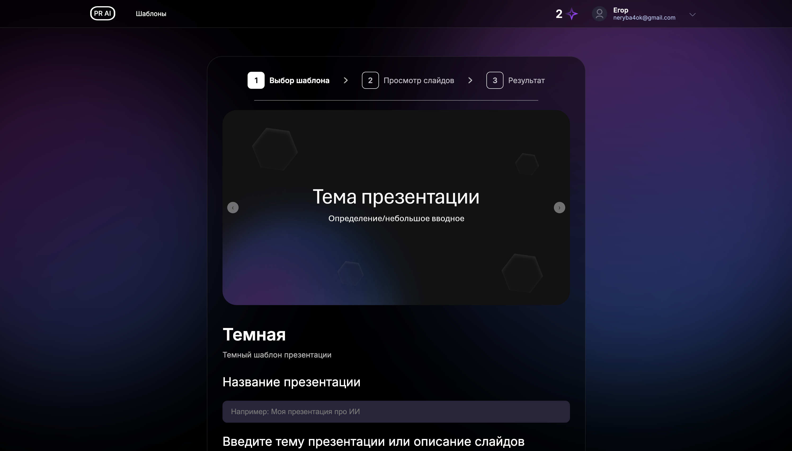

# PresentationAI

> Веб-приложение для автоматической генерации презентаций с помощью искусственного интеллекта.

[](https://presentationai.ru)

PresentationAI позволяет создавать профессиональные презентации в формате PPTX за считанные минуты. Выберите шаблон, укажите тему — система сгенерирует слайды с текстом и изображениями.

---

## Скриншоты

<details>
<summary><b>Главная страница</b></summary>


</details>

<details>
<summary><b>Каталог шаблонов</b></summary>


</details>

<details>
<summary><b>Редактор презентации</b></summary>


</details>

---

## Возможности

- **Авторизация** — регистрация и вход по JWT
- **Шаблоны** — выбор из готовых шаблонов презентаций
- **AI-генерация** — автоматическое создание контента через GigaChat
- **Изображения** — автоподбор релевантных фото через Unsplash
- **Drag & Drop** — перетаскивание и сортировка слайдов
- **Экспорт** — скачивание готовой презентации в PPTX
- **История** — все созданные презентации сохраняются в профиле
- **Адаптивность** — корректное отображение на любых устройствах

---

## Стек технологий

### Frontend
`React 19` `TypeScript` `Vite` `Redux Toolkit` `React Router`

### Backend
`Django 5.2` `Django REST Framework` `GigaChat API` `python-pptx` `Pillow`

### Инфраструктура
`PostgreSQL 17` `Docker` `Nginx` `Let's Encrypt`

---

## Быстрый старт

### Требования

- Docker и Docker Compose
- Node.js 18+ (для локальной разработки)
- Python 3.11+ (для локальной разработки)

### Установка и запуск

```bash
# Клонирование
git clone https://github.com/your-repo/presentationai.git
cd presentationai

# Настройка окружения
Описано ниже
# Запуск
docker-compose up --build
```

---

## Конфигурация

<details>
<summary><b>Frontend</b> — <code>frontend/.env</code></summary>

```env
VITE_API_URL=/api
```
</details>

<details>
<summary><b>Backend</b> — <code>backend/.env</code></summary>

```env
SECRET_KEY=your-secret-key
ALLOWED_HOSTS=localhost,127.0.0.1,your-domain.com
CORS_ALLOWED_ORIGINS=http://localhost:5173,https://your-domain.com
CSRF_TRUSTED_ORIGINS=http://localhost:5173,https://your-domain.com

# API
UNSPLASH_ACCESS_KEY=your-unsplash-key
GIGACHAT_CREDENTIALS=your-gigachat-credentials

# Email
EMAIL_HOST_USER=your-email@gmail.com
EMAIL_HOST_PASSWORD=your-app-password

# Database
DB_NAME=app
DB_USER=postgres
DB_PASSWORD=your-password
DB_HOST=pgdb
DB_PORT=5432

# Frontend
FRONTEND_URL=https://your-domain.com
```
</details>
